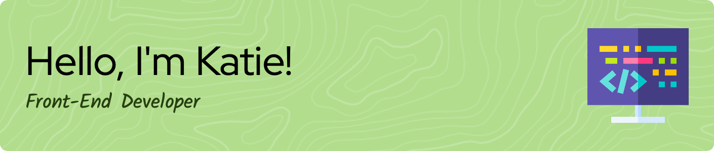

  

- 👩🏽‍💻 Front-end developer seeking new challenges to demonstrate and strengthen my skills through entry-level opportunities in web development/design.
- 📖 Studied front-end web development at Promineo Tech.
- ⚡️ Outside of web development, I am interested in UI/UX design, linguistics, research, editing/proofreading, and the arts.
- 🤝 Learn more about me here! https://www.linkedin.com/in/katieorgen/
  

